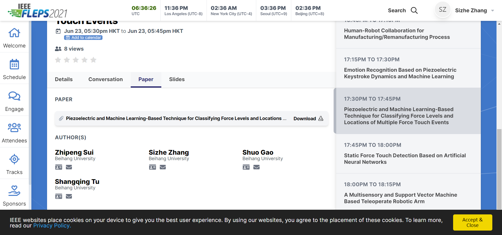
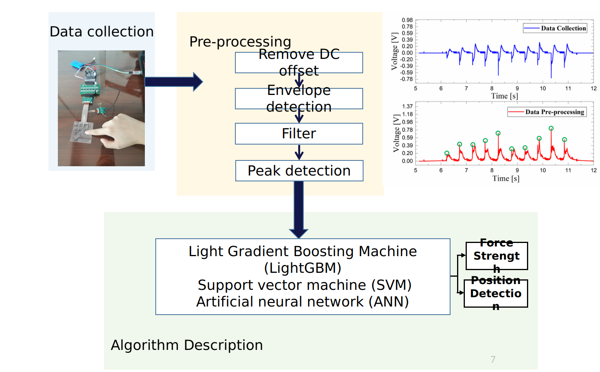

# 0.Introduction

This repository stores code and dataset for the IEEE-FLEPS 2021 paper "Piezoelectric and Machine Learning-Based Technique for Classifying Force Levels and Locations of Multiple Force Touch Events".

As the picture below shows, we give a lecture on the conference at `2021 June 23 17:30PM HKT`, thanks for the attendances' listening.



# 1.Data



- We collect data from `piezoelectric  panel` and processed the signal into these dataset: 

  - single_mixed_set.xlsx

    - Three volunteers were invited to touch the 16 locations, labelled from 1 to D, of the panel at three different force levels according to their personal feeling and experience. 

  - double_mixed_set.xlsx

    - Second, they were asked to carry out multiple touch events by using two fingers simultaneously. We found that it is hardprecisely control the strengths of two fingers at the same time. Hence, we consider three cases: light-light, middle-middle, strong-strong.

      


# 2.Multi-train

1. lgb

   1.  milti_train.py can start multiple training subprocesses which can be executed in parallel，set --max_depth_n1 --max_depth_n2. They are 2 **integer**,max_depth_n1 is the lower bound of the value of max_depth in the experiment，max_depth_n2 is the upper bound。n2～n1 will be split into `n2-n1` ，so there will be `n2-n1` different experiment.

   2. `interval_num` results with different accuracy rates from the experiment will be written in`./data/single_mixed/position/lgb/milti_train_result.txt`and `./data/single_mixed/force/lgb/milti_train_result.txt`

   3. command (It's going to produce 100 experiments, and it's going to run a little bit slower)

      ```bash
      python multi_train.py --category single_mixed --model lgb --max_depth_n1 1 --max_depth_n2 100
      ```

      

2. svm

   1. Similar to the lgb's milti_train principle, but with 2 parameters changed: gamma and C

   2. set --gamma_n1 --gamma_n2 . They are 2 **float**, gamma_n1 is the lower bound  of gamma，gamma_n2 is upper bound. --gamma_interval is the interval of gamma, so we will split n2～n1 into $\frac{n_2-n_1 }{interval}$ portion. 

   3. set parameter --C_n1 --C_n2. They are 2 **float**,--C_interval s the interval of C.

   4. command (It's going to produce 2400 experiments, and it's going to run a little bit slower)

      ```bash
      python multi_train.py --category single_mixed --model svm  --gamma_n1 2 --gamma_n2 8 --gamma_interval 0.1 --C_n1 0.1 --C_n2 4.1 --C_interval 0.1
      ```

3. network

   1. When it is 0.1 epoch, the train_loss, train_accuracy, valid_loss, valid_accuracy will be calculated once. Valid is a 9:1 test set, and in the case of a network it's a validation set.

   2. Train_loss is the average value of loss on the training set. Valid_accuracy is the average value of loss on the test set.

   3. command

      ```bash
      python train.py  --category single_mixed --model network --lr 3e-3 --weight_decay 1e-5 --task both
      ```

      ```bash
      python utils.py --log_path ./data/single_mixed/force/network/log.txt
      python utils.py --log_path ./data/single_mixed/position/network/log.txt
      ```

Note:

- tmp.txt is a temporary file that is useful until the multi_train.py run is complete. So don't change it while running multi_train.py
- I changed network_model.py. Since it was debugged on my CPU device, please let me know if there are any bugs running CUDA


# 3.Draw Picture

You just need to give the path of `log.txt`，then we can draw picture of loss and accuracy according to the `log.txt`.

e.g.：

```bash
python utils.py --log_path ./data/double_small/position/network/not_use_top2/log.txt
```

So we can use`./data/double_small/position/network/not_use_top2/log.txt` to draw 

Picture will be saved at `./figure/_data_double_small_position_network_not_use_top2_log`

Now，these picture can be drew:

```bash
python utils.py --log_path ./data/double_small/position/network/log.txt
python utils.py --log_path ./data/single_mixed/position/network/log.txt
python utils.py --log_path ./data/single_mixed/force/network/log.txt
```


